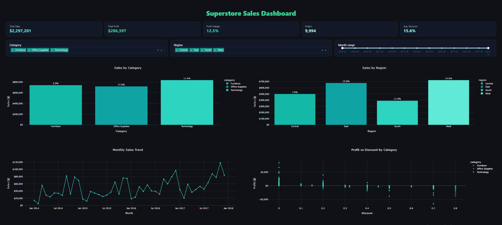
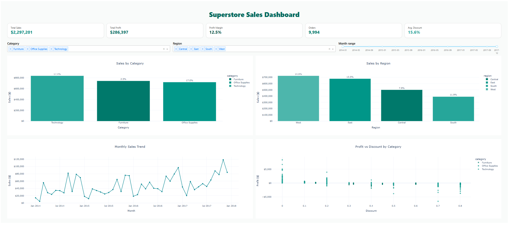
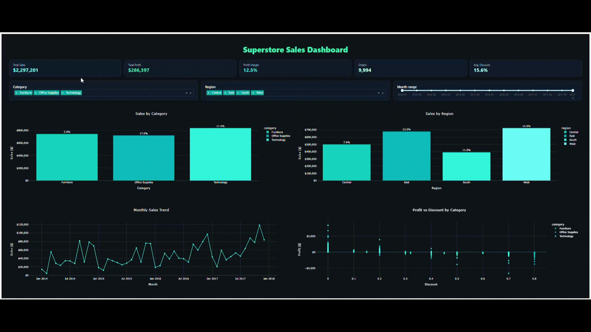
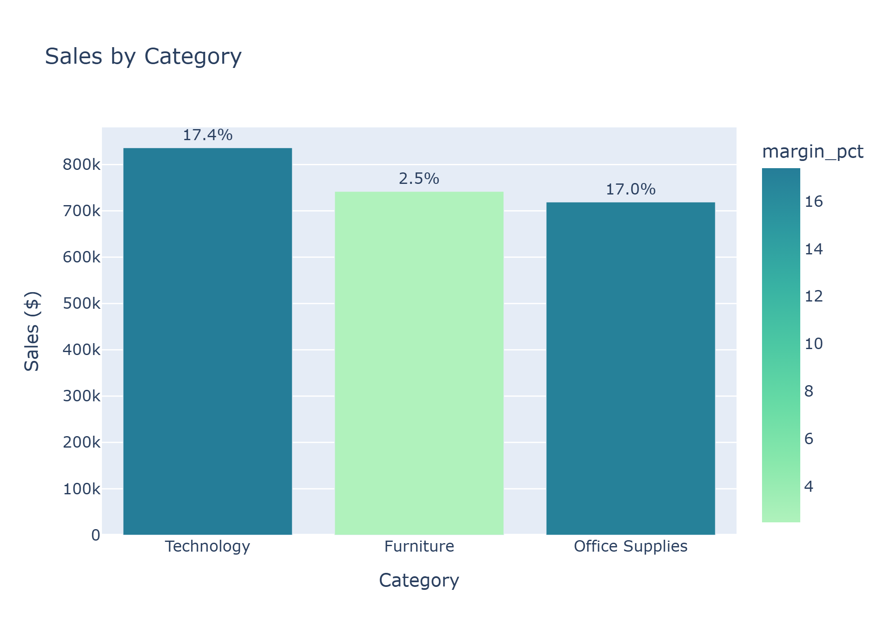
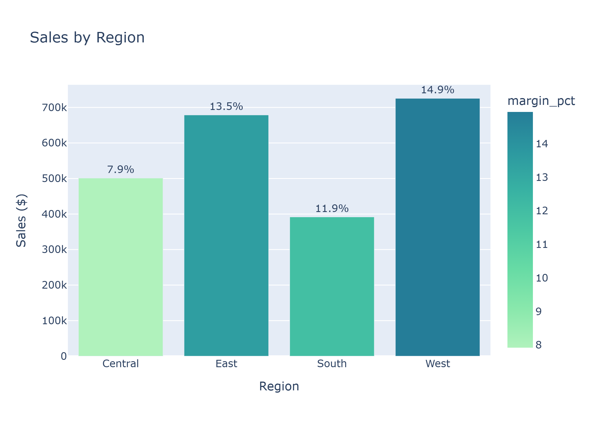
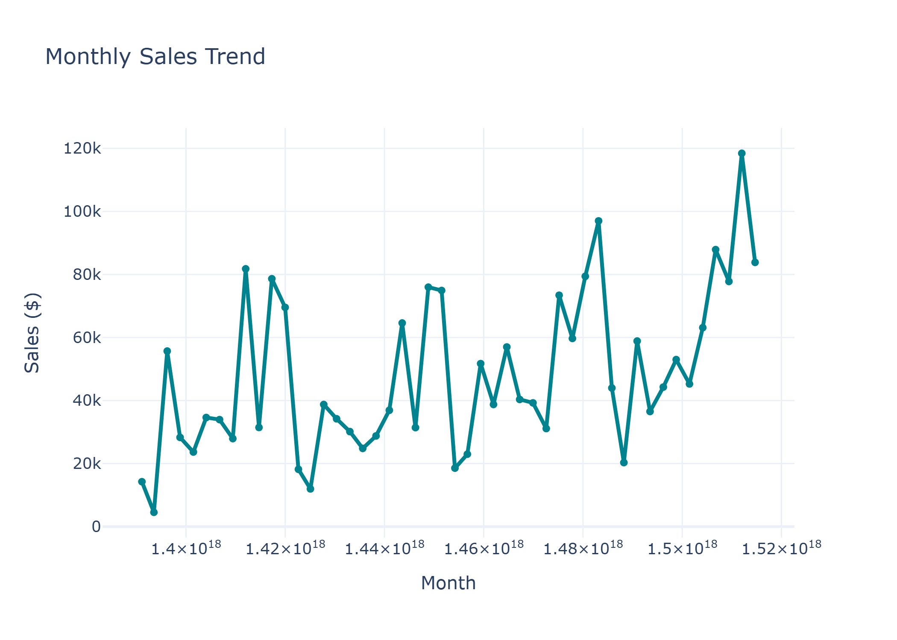
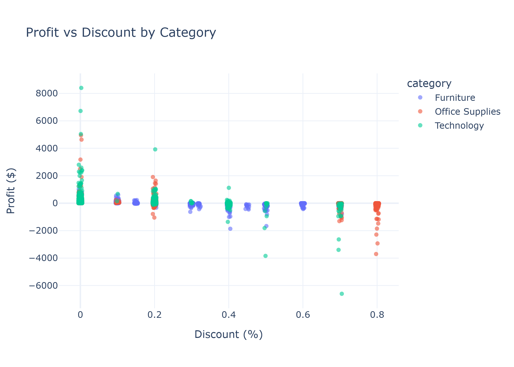
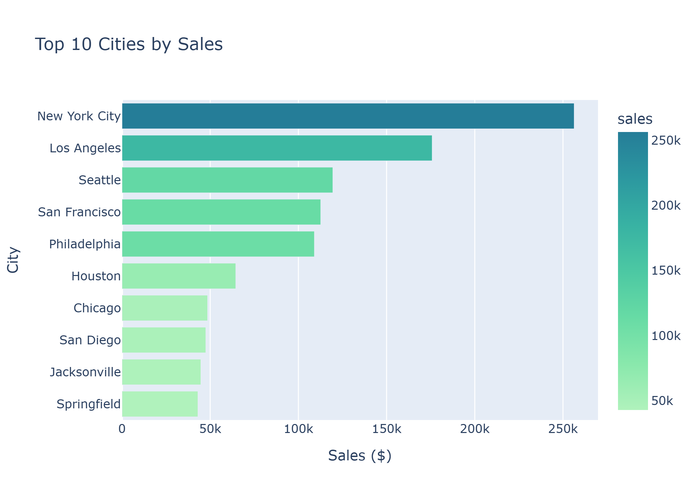

# 🛍️ Superstore Sales Dashboard — Python, Plotly & Dash
Interactive sales analysis dashboard built with **Python**, **Plotly**, and **Dash**.  
Includes KPIs, filters, and dynamic visualizations.

**Dashboard Dark theme**

--- 
**Dashboard light theme**

---

🎬 **Dashboard Demo**

<p align="center">
  
</p>

---

## 📖 Project Overview

This project is a **complete end-to-end Sales Analysis and Interactive Dashboard** built with  
**Python, Pandas, Plotly, and Dash**, using the *Sample Superstore* dataset (2014–2017).

It includes:
- Data cleaning and preprocessing  
- Exploratory data analysis (EDA)  
- Visualizations in Seaborn and Plotly  
- Interactive dashboard with live KPIs  

---

- Source: [Superstore Dataset (Kaggle)](https://www.kaggle.com/datasets/vivek468/superstore-dataset-final)
  
---

## 📂 Project Structure

sales_analysis_dashboard/
├─ dash/
│ └─ app.py
├─ data/
│ └─ Sample - Superstore.csv
├─ notebooks/
│ └─ sales_analysis.ipynb
├─ plots/
│ ├─ sales_by_category_plotly.png
│ ├─ sales_by_category_seaborn.png
│ ├─ sales_by_region_plotly.png
│ ├─ sales_by_region_seaborn.png
│ ├─ monthly_sales_trend_plotly.png
│ ├─ monthly_sales_trend_seaborn.png
│ ├─ profit_vs_discount_plotly.png
│ ├─ profit_vs_discount_seaborn.png
│ ├─ top_10_cities_by_sales_plotly.png
│ └─ top_10_cities_by_sales_seaborn.png
├─ dashboard/
│ ├─ supersales_dashboard_static.png
│ ├─ supersales_dashboard_static_light.png
│ └─ superstore_sales_dashboard.gif
├─ requirements.txt
├─ .gitignore
└─ README.md

---

## 🚀 Quick Start

### ▶️ Run the Notebook

```bash
pip install -r requirements.txt
jupyter notebook notebooks/sales_analysis.ipynb
▶️ Run the Dashboard Locally
python dash/app.py
Then open your browser and go to
👉 http://127.0.0.1:8050
```
---

📊 Dashboard KPIs

| KPI                     | Value      |
| ----------------------- | ---------- |
| 💰 **Total Sales**      | $2,297,201 |
| 💵 **Total Profit**     | $286,397   |
| 📈 **Profit Margin**    | 12.5%      |
| 📦 **Orders**           | 9,994      |
| 💸 **Average Discount** | 15.6%      |

---

💡 Key Insights

Technology category has the highest profit margin (~17.4%).
Furniture performs the worst (~2.5% margin).
West region drives the most profit (~14.9%).
Discounts show a strong negative correlation with profit.
Sales trend increases steadily through 2017, with Q4 peaks.

---

🎨 Dashboard Features

✨ Modern dark theme with teal-accented palette
📦 Dynamic KPIs cards for instant overview
🎚️ Filters for Category, Region, and Month Range
📊 Interactive Plotly charts (hover, zoom, filter)
📈 Real-time recalculation of metrics and visuals
📁 Exported static charts with Seaborn and Plotly

---

🧠 Tech Stack

| Area          | Tools                                          |
| ------------- | ---------------------------------------------- |
| Data Handling | `pandas`, `numpy`                              |
| Visualization | `plotly`, `dash`, `seaborn`, `matplotlib`      |
| Notebook      | `jupyter`, `pyarrow`                           |
| Dashboard     | `Dash Core Components`, `Dash HTML Components` |
| Theme         | Custom dark + teal palette                     |

---

📸 Visuals

| Library        | Example                                |
| -------------- | -------------------------------------- |
| **Plotly**     | Interactive visuals (used in Dash app) |
| **Seaborn**    | Static comparisons and EDA             |
| **Matplotlib** | Trend validation & complementary plots |







---

🧩 Next Steps

✅ Forecasting models (Prophet / ARIMA)
✅ Customer segmentation analysis
✅ Dynamic filters by state and product type
✅ Deployment to cloud (Render / AWS / Hugging Face Spaces)


🛠️ Installation Requirements

Dependencies listed in requirements.txt:
pandas>=2.0
numpy>=1.24
plotly>=5.20
dash>=2.14
seaborn>=0.13
matplotlib>=3.8
pyarrow>=15.0

---

🧑‍💻 Author

Mónica Venzor
📍 Data Analyst Jr | SQL | Excel | Power BI | Python | Data Visualization | Machine Learning Enthusiast
🔗[LinkedIn](https://www.linkedin.com/in/monicavenzor/) |  — [GitHub](https://github.com/MonicaVenzor)  
---

📜 License

This project is licensed under the MIT License — free for educational and personal use.

---
⭐ If you found this project useful or inspiring, please give it a star!
It helps others discover it and supports more open projects like this 💫
---
